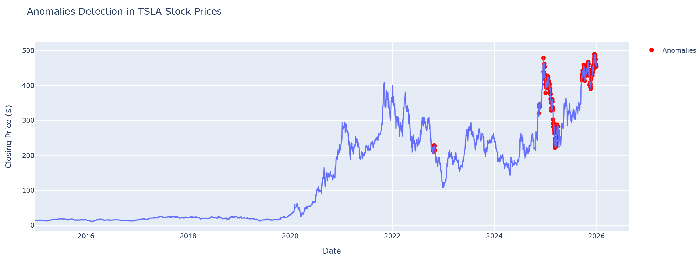
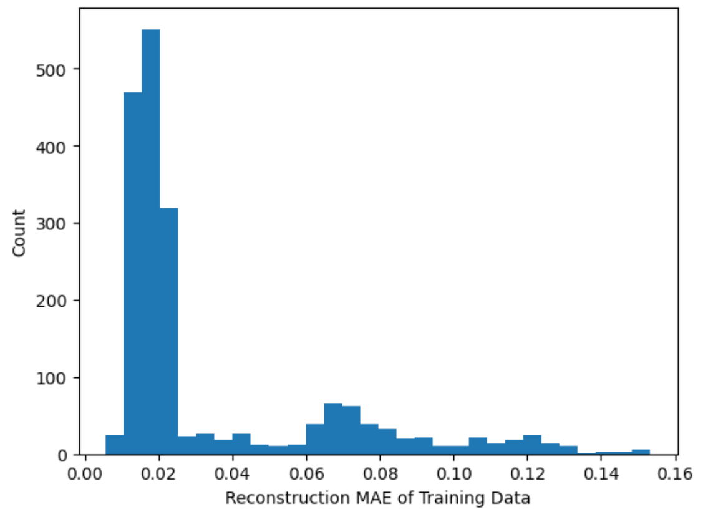
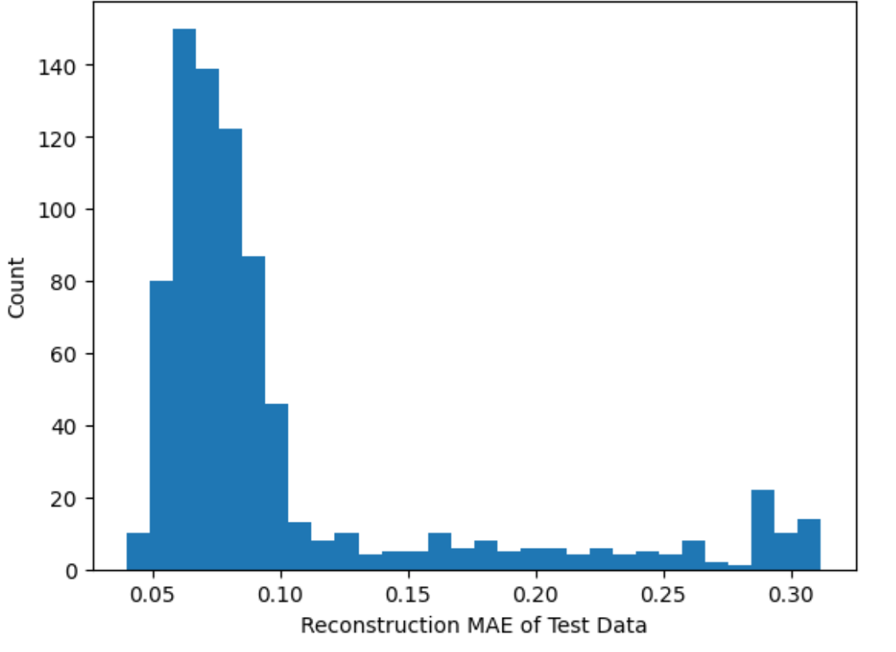
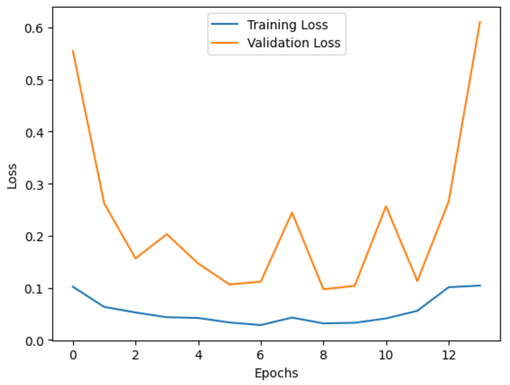
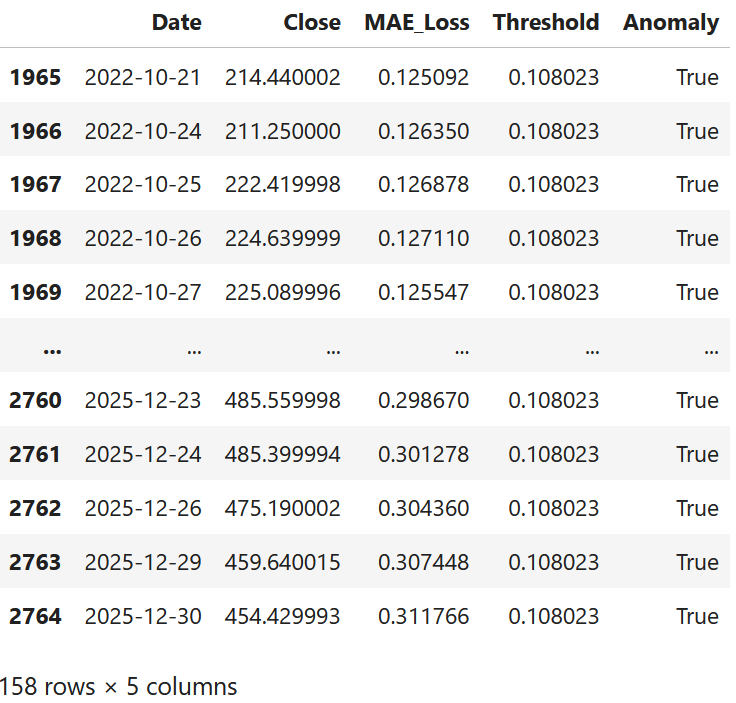

# Quantimental Strategy (Part 2): Time Series Anomaly Detection with LSTM Autoencoder

The "Quantimental" strategy represents a sophisticated investment framework that merges the structural depth of Fundamental Analysis with the algorithmic precision of Quantitative Modeling.

This project serves as the technical engine of the strategy, utilizing an unsupervised Deep Learning pipeline to monitor market behavior. By implementing an LSTM Autoencoder, the system identifies abnormal price movements in Tesla’s (TSLA) stock between 2015 and 2025. While **[Part 1 (Fundamental Dashboard)](https://github.com/cckmwong-data/tech_fundamental_analysis)** defines what the stock should be worth, this project identifies exactly when the market is deviating from historical norms.

---

## The Integration: Fundamentals + Technical Analysis
Most investment tools provide either financial data or technical indicators. This project integrates both to create a high-conviction decision engine:

* **[1. The Fundamental Core](https://github.com/cckmwong-data/tech_fundamental_analysis):** Determines **Intrinsic Value** using a dynamic 10-year DCF model. It answers: *"What is this company actually worth?"*
* **2. The AI Layer (this project):** Detects **Price Anomalies** in Tesla (TSLA) stock (2015-2025). It answers: *"Is the current market price deviating irrationally from historical patterns?"*

**Strategic Use Case:** When the Power BI model shows a stock is undervalued, and the LSTM model flags a negative price anomaly (high reconstruction error), it signals a statistically significant **Mean Reversion** buying opportunity.

---

## Overview
Financial markets are highly dynamic and influenced by numerous factors, including macroeconomic indicators, investor sentiment, and global events. Detecting anomalies in stock prices is essential for uncovering unusual patterns that may signal market manipulation, financial fraud, or rare investment opportunities.

In this [project](https://github.com/cckmwong-data/stock_price_anomaly/blob/main/anomaly_LSTM_gh.ipynb), **Long Short-Term Memory (LSTM) autoencoder** is used to reconstruct stock price sequences. If the model struggles to accurately reconstruct a sequence (i.e., produces a large reconstruction error), the sequence likely contains anomalous behavior. *Anomalies are flagged when the deviation between the actual and reconstructed price exceeds the 95th percentile of the historical reconstruction error which is represented by Mean Absolute Error (MAE)*. 

---

## Skills Demonstrated
✔ **Time Series Modeling**

✔ Deep Learning (**LSTM Autoencoders**)

✔ **Machine Learning** Model Training & Evaluation

✔ Real-world Data Retrieval & API Usage (**Yahoo Finance**)

✔ Anomaly Detection & **Reconstruction Error Thresholding**

✔ **Engineered preprocessing** pipeline including scaling, windowing, and reconstruction thresholding

---

## Data
Historical daily price data for Tesla (TSLA) was retrieved via Yahoo Finance. The dataset includes open, high, low, close, adjusted close, and volume fields. The *closing price* was selected as the primary target series for anomaly detection due to its common use in financial modeling and price-based analysis.

Data pre-processing steps included:
- Train-test splitting
- Scaling using *Min-Max normalization*
- Sliding window segmentation for sequence modeling
- Reconstruction error computation for anomaly scoring

---

## Key Technical Decisions

**Unsupervised anomaly detection (LSTM Autoencoder) vs. supervised classification (e.g. Logistic Regression)**: Supervised classification requires labeled anomalies, which are scarce and subjective in financial contexts.  Unsupervised learning enables detection of rare or previously unseen patterns without manual annotation.

**LSTM Autoencoder vs. classical statistical models (e.g., ARIMA)**: Autoregressive Integrated Moving Average (ARIMA) handles linear and stationary signals but struggles with nonlinear temporal dependencies.  LSTM Autoencoders capture nonlinear patterns and multi-step dependencies, improving anomaly sensitivity in financial series.

**Reconstruction-based detection vs. prediction-based detection**: Forecasting future values and measuring prediction error can infer anomalies. Reconstruction avoids prediction uncertainty and highlights unusual behavior by comparing inputs to their reconstructed versions.

**Sliding window sequence formation vs. single-point modeling**: Single-point modeling ignores temporal context. Window-based encoding captures more short-term market patterns and improves model performance.

**MinMaxScaler vs. StandardScaler**: Min-Max scaler is preferred because it preserves the structure of price movements and stabilizes the reconstruction process, whereas StandardScaler, by contrast, centers and scales to variance.

---

## Key Insights & Impacts
- Anomalies often precede market stress, liquidity shocks, or volatility spikes. Detecting them early enables preemptive adjustments to exposure, hedging, or portfolio allocation, which is vital for risk management and detection of manipulative activities/ investment opportunities.
- Reconstruction-based anomaly detection generalizes across industries including manufacturing (sensor faults), cybersecurity (intrusions), and healthcare (patient monitoring).

---

## Integration with Fundamental Analysis

Detecting price anomalies is valuable when paired with **fundamental analysis**, which estimates intrinsic value based on margins, growth and competitive positioning. The two methods operate on different horizons:

*Fundamentals are slow-moving and persistent.*

*Anomalies are fast-moving and can reflect sentiment, liquidity, or narrative shocks.*

The combination enables several investment use cases help identify potential entry and exit points. *Downward anomalies* may signal temporary dislocations or liquidity-driven selling that creates potential *buying* opportunities, while *upward anomalies* may signal elevated risk or *profit-taking* conditions if fundamentals do not justify the move. In both cases, the anomaly identifies the when, and fundamentals determine the why.

---

## Model Evaluation

We evaluate the model by comparing the reconstruction errors of the training data and test data, with the latter showing a significantly higher MAE due to the presence of anomalies. 

Additionally, the **training loss** (blue curve) remains low and steady showing the model is learning the training data well. The **validation loss curve** (orange curve) is bumpy and shows great oscillation, as the unusual price pattern (anomalies) are hard to reconstruct resulting to large reconstruction error.

---

## Results Summary
The anomaly detection pipeline identified periods where reconstruction error spiked over the threshold (i.e. 95th percentile of the historical reconstruction errors), indicating deviations from learned baseline behavior. These anomalies aligned with major market events as follows.

- **Nov 2024**: Share prices surged on optimism of Donald Trump's election victory.

- **Dec 2024**: After TSLA shares reached its all-time high on 17th Decemeber 2024, the shares plunged, due to weak market sentiment on trade tariffs by the US as well as TESLA's declining sales data.

- **Mar 2025**: Shares extended further losses, amid market concerns over Elon Musk’s involvement with the Trump administration as well as the falling new vehicle sales.

- **Sep 2025**: Elon Musk buying back $1bn in Tesla Shares, a signal of confidence of the company

- **Oct-Dec 2025**: TSLA shares saw a strong recovery, thanks to strategic narrative shifts - positioning the company as an artificial intelligence (AI) and autonomy leader, not just an electric vehicle (EV) maker.

---

## Author
Carmen Wong

---

## Disclaimer
*This project is for informational purposes only. The anomaly flags generated do not constitute financial advice. Always perform your own due diligence before making investment decisions.*
